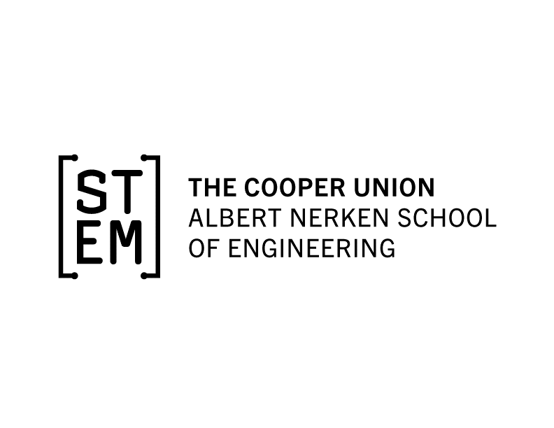



 
# Smart Technology and Urban Agriculture
 ## Who Are We?
 CUSAP or Cooper Union Sustainable Agricultural Project, is a socially and ecologically integrated initiative for plant cultivation, community assimilation, and education. We are committed to exploring the various ways in which food systems can integrate into the urban environment. We’ve created and conceptualized distinct hydroponic systems, a deployable green-house, and worked with professors as peers  
to develop classes that reflect student interest. At the core of our many projects is a team ethos that prioritizes  diverse collaboration.

## What is this repository for?
This repository serves to provide a collection of all of the documents that have been provided throughout the course. 

> Written with [StackEdit](https://stackedit.io/).
